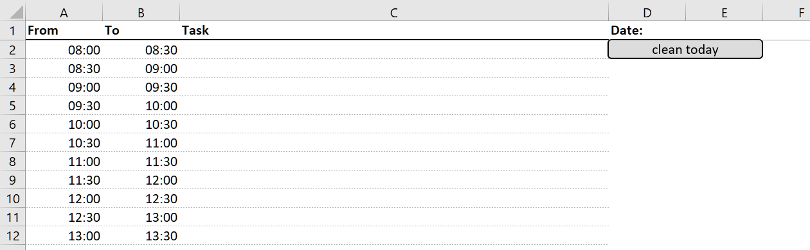

This project contains VBA code to automatically generate and manage a to-do list and a day planner in Microsoft Excel.
It was developed for Microsoft Office LTSC Professional Plus 2021, and runs inside any macro-enabled Excel workbook (`.xlsm`).

# 1) Excel To-Do List Generator

The Excel to-do list helps you organize tasks by category, importance, dependence,
and emotional effort. It provides a clear structure with buttons to sort and
filter your tasks. Color highlights make it easy to spot quick tasks,
high-priority items, or tasks from specific categories.

## Columns of the to-do list

The VBA script creates a structured Excel sheet with the following columns:

| Column               | Type      | Description                                                                                                                                                   |
| -------------------- | --------- | ------------------------------------------------------------------------------------------------------------------------------------------------------------- |
| **Category**         | Text      | The category of your task. *(Required for the buttons to work)*                                                                                                                       |
| **Importance**       | Number    | Priority level: 1 = important. If set to 0, the task is not a real to-do, but something to keep in mind. Rows with value 0 are marked light grey. Value 1 cells are marked yellow. Value 2 cells are marked red as soon as you sort the document via "sort documents."|
| **Time needed**      | Number    | Estimated time required (unit-free: e.g., 1 = short, 100 = long).                                                                                              |
| **Emotional effort** | Number    | How emotionally demanding the task is. Higher values indicate more emotional effort.                                                                                    |
| **Dependence**       | Text      | Notes about dependencies (e.g., "after meeting," "waiting for reply").                                                                                        |
| **Task**             | Text      | Description of what needs to be done.                                                                                                                         |
| **When**             | Date/Text | Due date or schedule indicator.                                                                                                                               |
| **Hide**             | 0/1       | 0 = visible, 1 = hidden when using the "hide" button.                                                                                                    |

## Buttons of the to-do list

Several buttons are added to help you manage tasks easily:

- "sort document": Sorts tasks by importance, time, emotional effort, and dependence. It also:
    - Fills empty Dependence cells with `.`
    - Fills empty Hide cells with `0`
    - Highlights tasks due today in red

- "hide low": Hide tasks with low importance (<100).

- "sort time": Sorts only by the `Time needed` column.

- "lines": Creates dotted lines between the tasks. Should be run after major changes to remove unneeded lines and add new ones.
    If you don't want any lines, remove them manually.

- "hide dependence": Hides all tasks with a non-empty `Dependence` field.

- "show all": Clears filters and shows all rows.

- "hide": Hides all rows where `Hide` is `1`.

- "set 0": Sets all visible `Hide` cells to `0`.
    Hidden rows will not be affected — make sure filters are off before using.

# 2) Day Planner

While the to-do list helps track tasks across days or months,
the day planner focuses on structuring a single day.
It provides a clear, time-blocked layout to schedule your tasks.

At the end of the day, you can use the "clean today" button to clear all
entries and formatting in columns `A` to `C`, without affecting the rest of the sheet.

# 3) Setting up this Project

1) Open a new Excel file and save it as a macro-enabled workbook (`.xlsm`).

2) Enable the Developer tab in Excel:
    (Only necessary if you haven't done this before.)

    File → Options → Customize Ribbon → Check "Developer"

3) Go to the Developer tab → Visual Basic.

4) Import `Code.bas`:

    Right-click your VBA project → Import File… → select `Code.bas`

    Or paste the code into a new module manually.

## Running the code

In the module, locate the function `Create_TODO_sheet()` to create a to-do
list and `Create_Today_sheet()` to create the TODAY sheet.
Place the cursor inside it and click the green run button.
Important: You need to have an empty Excel file activated,
otherwise, your entries might get overwritten.

Caution: If you have several Excel files open that run this code, the buttons won't work anymore.
In such a case, you should specify the function calls as such:

    `shape.OnAction = "'MyWorkbook.xlsm'!Function_Name"`

However, you can easily set up several to-do lists inside an Excel file (e.g., "TODO private", "TODO work").

## Customizing the code

For regular use, you don’t need to modify any part of the code — it works out of the box.
However, you're welcome to adapt it to better suit your workflow.

A suggested customization is to highlight specific task categories. To do this:

Open your module in the VBA editor and search for `Topic1`, `Topic2`, and `Topic3`.
Then replace these placeholders with the names of your most important categories.
You can also change the highlight colors applied to each category.

These changes will take effect every time you run the "sort document" button.

# License

This project is licensed under the MIT License.
See the full license text here: [MIT License](https://opensource.org/licenses/MIT).

Note: While this Excel project predates ChatGPT, recent updates and improvements were made with assistance from ChatGPT.